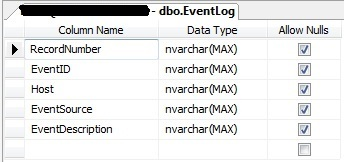
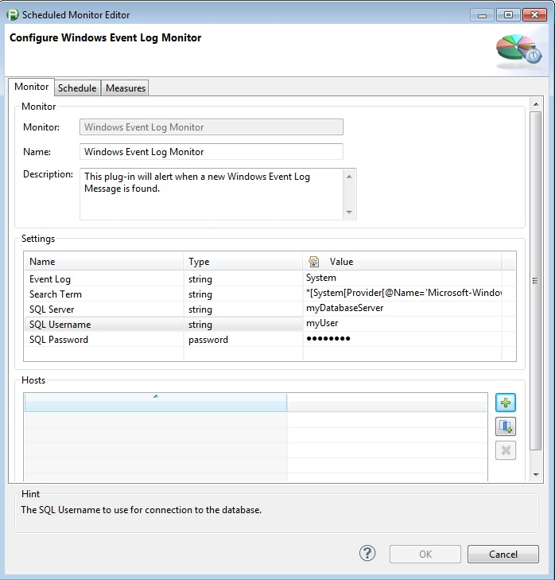
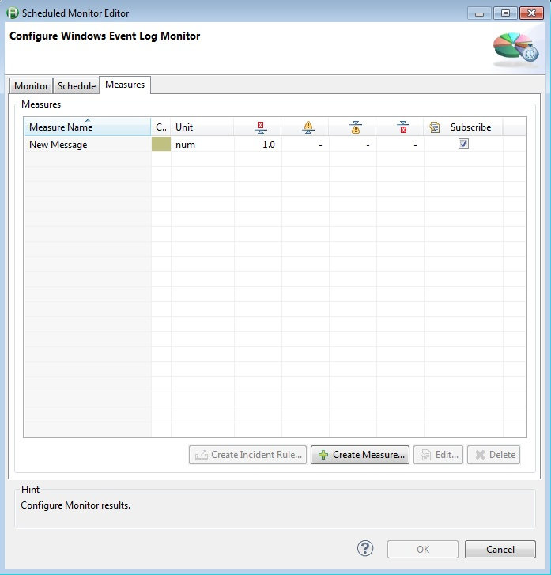
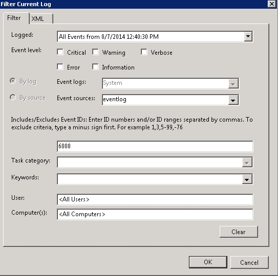
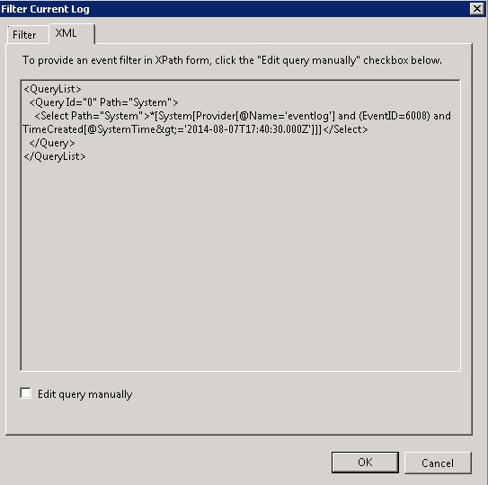
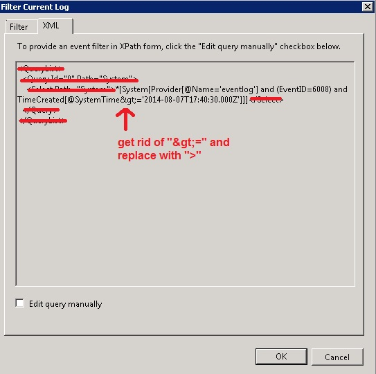

<html xmlns="http://www.w3.org/1999/xhtml">
<head>
    <title>Windows Event Log Monitor</title>
    <meta http-equiv="Content-Type" content="text/html; charset=UTF-8"/>
    <meta http-equiv="X-UA-Compatible" content="IE=EmulateIE8" />
    <meta content="Scroll Wiki Publisher" name="generator"/>
    <link type="text/css" rel="stylesheet" href="css/blueprint/liquid.css" media="screen, projection"/>
    <link type="text/css" rel="stylesheet" href="css/blueprint/print.css" media="print"/>
    <link type="text/css" rel="stylesheet" href="css/content-style.css" media="screen, projection, print"/>
    <link type="text/css" rel="stylesheet" href="css/screen.css" media="screen, projection"/>
    <link type="text/css" rel="stylesheet" href="css/print.css" media="print"/>
</head>
<body>
                <h1>Windows Event Log Monitor</h1>
    

        <h2>Overview</h2>
    

    

    

            
        The Windows Event Log Plugin will monitor the Windows Event Log for the existance of a given event. It stores the event details in a SQL database so that it knows where it ended the last time it ran so it's not seeing the same events over and over.    

    

        <table>
<thead class=" "></thead><tfoot class=" "></tfoot><tbody class=" ">    <tr>
            <td rowspan="1" colspan="1">
        

Name and Version    

            </td>
                <td rowspan="1" colspan="1">
        

Windows Event Log Monitor    

            </td>
        </tr>
    <tr>
            <td rowspan="1" colspan="1">
        

Compatible with    

            </td>
                <td rowspan="1" colspan="1">
        

dynaTrace 5.x, 6.x    

            </td>
        </tr>
    <tr>
            <td rowspan="1" colspan="1">
        

Author    

            </td>
                <td rowspan="1" colspan="1">
        

Derek Abing    

            </td>
        </tr>
    <tr>
            <td rowspan="1" colspan="1">
        

<a href="https://community/display/DL/Licenses">License</a>    

            </td>
                <td rowspan="1" colspan="1">
        

<a href="attachments_5275722_2_dynaTraceBSD.txt">dynaTrace BSD</a>    

            </td>
        </tr>
    <tr>
            <td rowspan="1" colspan="1">
        

<a href="https://community/display/DL/Support+Levels">Support Level</a>    

            </td>
                <td rowspan="1" colspan="1">
        

<a href="https://community/display/DL/Support+Levels">Community Supported</a>    

            </td>
        </tr>
    <tr>
            <td rowspan="1" colspan="1">
        

Download    

            </td>
                <td rowspan="1" colspan="1">
        

<a href="attachments_174754202_1_com.eventLogMonitor_1.5.0.jar">com.eventLogMonitor_1.5.0.jar</a>    

            </td>
        </tr>
    <tr>
            <td rowspan="1" colspan="1">
        

Screenshots    

            </td>
                <td rowspan="1" colspan="1">
        

    

    

        <table>
<thead class=" "></thead><tfoot class=" "></tfoot><tbody class=" ">    <tr>
            <td rowspan="1" colspan="1">
        

            
            

            </td>
                <td rowspan="1" colspan="1">
        

            
            

            </td>
        </tr>
    <tr>
            <td rowspan="1" colspan="1">
                </td>
                <td rowspan="1" colspan="1">
                </td>
        </tr>
    <tr>
            <td rowspan="1" colspan="1">
        

            
            

            </td>
                <td rowspan="1" colspan="1">
        

            
            

            </td>
        </tr>
    <tr>
            <td rowspan="1" colspan="1">
                </td>
                <td rowspan="1" colspan="1">
                </td>
        </tr>
    <tr>
            <td rowspan="1" colspan="1">
        

            
            

            </td>
                <td rowspan="1" colspan="1">
        

            
            

            </td>
        </tr>
    <tr>
            <td rowspan="1" colspan="1">
                </td>
                <td rowspan="1" colspan="1">
                </td>
        </tr>
</tbody>        </table>
            

            </td>
        </tr>
    <tr>
            <td rowspan="1" colspan="1">
        

Installation    

            </td>
                <td rowspan="1" colspan="1">
        

Import the plugin on the dynaTrace Server. For more details see <a href="https://community/display/DOCDT60/Plugins">Plugins</a>    

    

The table in the database can be created by running <a href="attachments_178488265_1_Create_EventLog.sql">this SQL script </a>or you can use the screenshot from the Design view in the table to manually enter the values. The script will create the table on a database called dynaTracePluginDB. Change this name if you desire    

            </td>
        </tr>
</tbody>        </table>
            

    

    

        <h2></h2>
    

    

        <h2>Monitor Properties</h2>
    

When setting up the monitor you need to define the following configuration properties    

    

        <table>
<thead class=" ">    <tr>
            <td rowspan="1" colspan="1">
        

Property    

            </td>
                <td rowspan="1" colspan="1">
        

Description    

            </td>
        </tr>
</thead><tfoot class=" "></tfoot><tbody class=" ">    <tr>
            <td rowspan="1" colspan="1">
        

EventLog    

            </td>
                <td rowspan="1" colspan="1">
        

Enter which Event Log the event is in (i.e. Application, System, Security, etc).    

            </td>
        </tr>
    <tr>
            <td rowspan="1" colspan="1">
        

Search Term    

            </td>
                <td rowspan="1" colspan="1">
        

The search term obtained from the XML in windows event log. You can either tweak the values from the below example. Otherwise, in order to obtain the Search Term in regex format, you have to log onto the server, apply the filter (as seen in the image) and then click on the XML tab which will show you the XML of the filter. Remove everything from the filter (as seen in the image) and you'll want to make sure your Date/Time is set to greater than (&quot;&gt;&quot;). That way the first time the Monitor runs it will start with the records after that date and will keep track of where it left off going forward.    

    

    

    

EXAMPLE: *[System[Provider[@Name='eventlog' or @Name='Microsoft-Windows-Eventlog'] and (EventID=6008) and TimeCreated[@SystemTime&gt;'2014-01-13T06:00:00.000Z']]]    

            </td>
        </tr>
    <tr>
            <td rowspan="1" colspan="1">
        

SQLServer    

            </td>
                <td rowspan="1" colspan="1">
        

Enter the name of you SQL Database Server where you created the dynaTracePluginDB database.    

            </td>
        </tr>
    <tr>
            <td rowspan="1" colspan="1">
        

Username    

            </td>
                <td rowspan="1" colspan="1">
        

Enter the username to connect to the database. (SQL Server Authentication)    

            </td>
        </tr>
    <tr>
            <td rowspan="1" colspan="1">
        

Password    

            </td>
                <td rowspan="1" colspan="1">
        

Enter password for username used. (SQL Server Authentication)    

            </td>
        </tr>
</tbody>        </table>
            

    

    

        <h2>Monitoring Measures</h2>
    

        <table>
<thead class=" ">    <tr>
            <td rowspan="1" colspan="1">
        

Measure    

            </td>
                <td rowspan="1" colspan="1">
        

Description    

            </td>
        </tr>
</thead><tfoot class=" "></tfoot><tbody class=" ">    <tr>
            <td rowspan="1" colspan="1">
        

New Message    

            </td>
                <td rowspan="1" colspan="1">
        

If a new event log message is found this number will be 1, otherwise it will be 0    

            </td>
        </tr>
</tbody>        </table>
            

    

            

        

        

        

    

</body>
</html>
